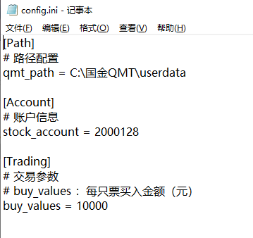
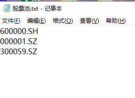
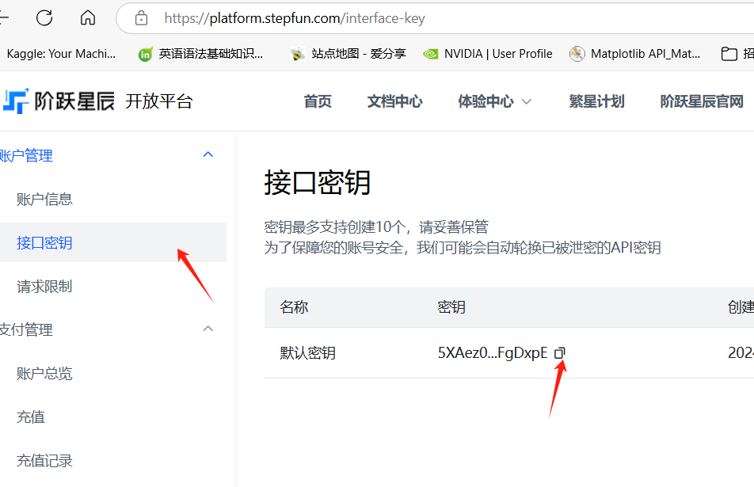
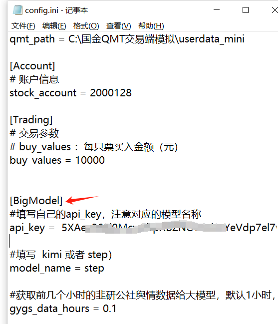
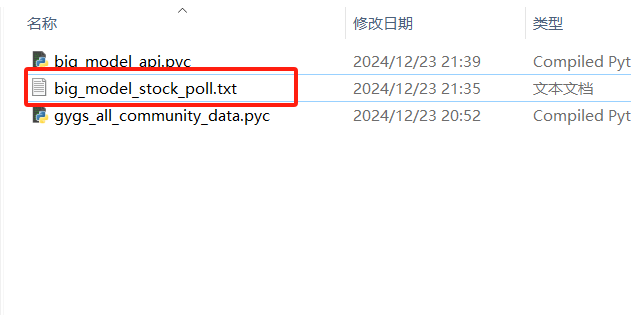
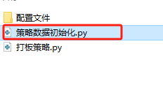
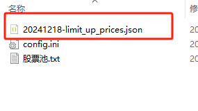
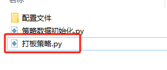

## **[QuantLimit](https://github.com/123quant/QuantLimit)**

该项目实现了一种**量化打板策略**，用于A股股票交易，涨停板制度只存在于A股市场,

旨在识别并利用市场中潜在的涨停机会。该策略通过技术指标、历史价格数据和成交量分析，股吧数据分析获取可能达到涨停的股票池，并在股票涨停瞬间买入以获取隔日高溢价。

## 安装步骤

克隆仓库：

```
bash

复制代码
git clone  https://github.com/123quant/QMT-QuantLimit.git
```

安装所需依赖：

```
复制代码
pip install -r requirements.txt
```

初始化playwright，只需要做一次

```
python -m playwright install
```


## 使用方法

1.配置参数

打开 配置文件->config.ini

<p align="center">
  
</p>

本策略通过miniqmt实现，需要配置三个参数

- qmt_path ：qmt软件的安装路径
- stock_account ：股票账号
- buy_values ：每只票买入金额

2.填好配置文件，第二步上传股票池

- 2.1打开 配置文件->股票池.txt

<p align="center">
  
</p>


把需要监控的股票填进股票池，也可以使用同花顺、通达信导出的股票池。


- 2.1新增大模型和问财自动选股


打开配置文件需要填写3个参数

​	**api_key：** 自己的大模型的api_key，没有的可以点击下面的链接注册申请

<p align="center">
  
</p>


​	model_name：选择哪个大模型，现在支持 [kimi]( https://platform.moonshot.cn/)  和  [阶跃星辰]( https://platform.stepfun.com/)（step）

- 这两个模型都可以免费申请使用

<p align="center">
  
</p>

**gygs_data_hours：**  配置完大模型参数还有就是我们的数据来源与 [韭研公社](https://www.jiuyangongshe.com/) ，gygs_data_hours 是获取社区前几个显示的数据给大模型

最后运行代码获取大模型股票池

```python
#在运行代码前需要先cd 到本项目目录下
python .\选股\舆情选股\big_model_api.pyc
```

<p align="center">
  
</p>

运行结束就会在 .\选股\舆情选股 目录下看到一个股票池


3.在每日打板策略运行前，需要先初始化涨停板数据

直接运行    策略数据初始化.py

```
#先进入当前目录
python 策略数据初始化.py
```

<p align="center">
  
</p>

运行结束后在配置文件价下有一个json数据，记录今日沪深A股的涨停价

<p align="center">
  
</p>

4.最后直接运行策略，开始打板

```
#先进入文件目录
python ./打板策略.py
```

<p align="center">
  
</p>


## 后续

本项目后续会继续完善，包括但不限于一下几个方面：

- 自动股票池：本功能已经实现大模型获取韭研公社数据自动选股，后续还需更新
- 加入L2数据：L1数据是3s一个的切片，L2数据更能实时的监控打板。
- 加入异动打：根据盘中异动自动加入打板监控
- 。。。
## 加入
有打低位板的朋友可以一起探讨
<p align="center">
  
</p>

## 由于二维码有时效可以加我微信拉你进群，注意备注来意：bz_lhbxs
